# Mentor Matching Machine
# Table of Contents
1. [Getting_Started](#Getting_Started)
2. [Prerequisites](#Prerequisites)
3. [Installation](#Installation)
4. [Running](#Running)
5. [Mentor_Matching_Machine](#Mentor_Matching_Machine)
6. [Login](#Login)
7. [Mentor_Madness](#Mentor_Madness)
8. [Survey_Filling_App](#Survey_Filling_App)
9. [Data_Dashboard](#Data_Dashboard)
10. [Contributors](#Contributors)
# Getting_Started
This project was built  as a SPA(Single Page Application) in React to communicate with a data base in the back-end running in this app as a RESTful API. As the first step is to get data from an end point to display the companies and mentors that had their first meeting. The app will take the user input as data and send it to the data base, if it is the first time the user will send data by submitting the survey, it will do a POST with axios, if the user is updating a previous answered survey, it will do a PUT instead, the application will display which surveys have been submitted before and will display a progress bar that reflects the total number of surveys to complete.
The users must access this aplication through a link that will be sent to their email.
# Prerequisites
* npm => v6.14.4
* All the const variables with a url address must be changed to http://localhost:3000
# Installation
* git clone https://github.com/devarias/techstars-app.git
* cd techstars-app
* ./dependencies.sh => In this file you'll find all the node package modules to install.
* Everything is installed and ready to run.
# Running
* npm run dev => This command will start running the API as a development environment, to apply changes during the modification of the files.
* npm start => This command will start running the API as a production environment, if you want to do a change, they will not be applied to the running app.
# Mentor_Matching_Machine

This projects consists of a SPA(single page application) with multiple views, which are divided into the Login, Mentor Madness(Scheduling), Survey Application, and finally the Data Dashboard.
# Login
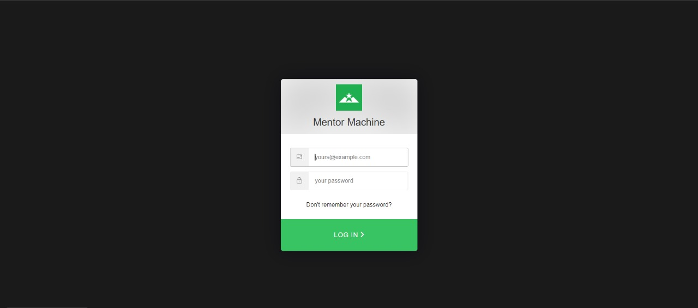
This view is meant only for the programm manager or associate from Techstars, this works with auth0, which will validate the credentials through user and password, once the validation is done, it will redirect the user to the main view where it can select between Scheduling or Matching, or Logout if the case needs to be.
# Mentor_Madness
This is where the programm manager, or assiociates will assemble the meetings between mentors and companies.
This project has 4 general views
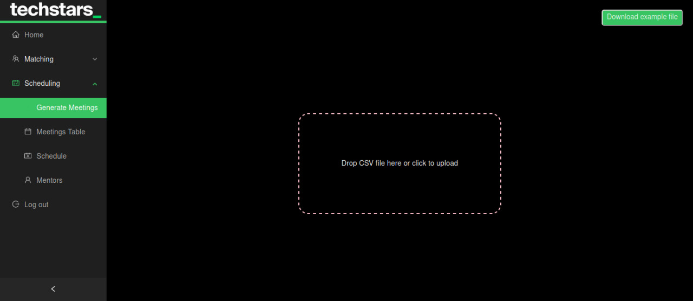
* Generate Meetings, this loads a CSV file through drag and drop, drag file and drop in a specified area, the CSV file contains all the companies that corresponds to each mentor, after the file was loaded, it will re-route you to the next view, hitting the icon at the right superior corner allows to download a CSV template so the user doesn't have to deal with formatting issues.
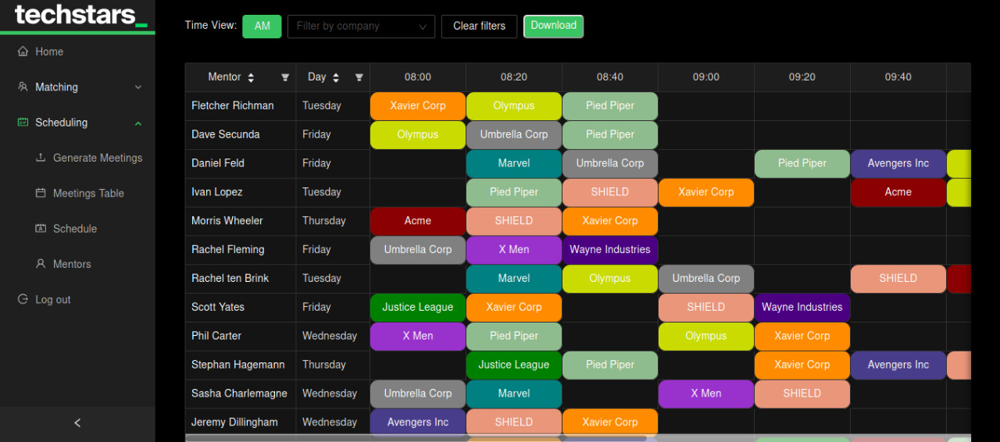
* Meetings Table, this has a time table where each row will be a mentor that is going to have meetings in timeblocks assigned to companies in the columns, you could modify the display by filtering through mentors, companies, time blocks, days, hitting the icon at the right superior corner allows to download a CSV template so the user doesn't have to deal with meetings table formatting issues.
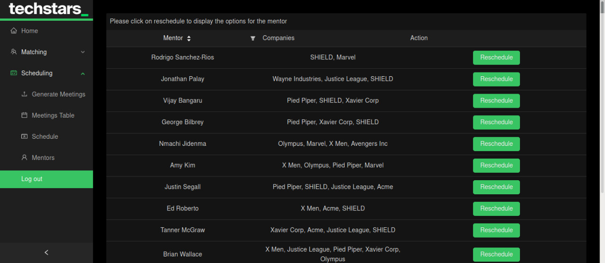
* Schedule, will display all the mentors that havent been asigned for a meeting with a company, due to cancelation by mentor, or haven't picked a time frame for the meeting, this could be filtered by mentors, companies, time blocks, and days.
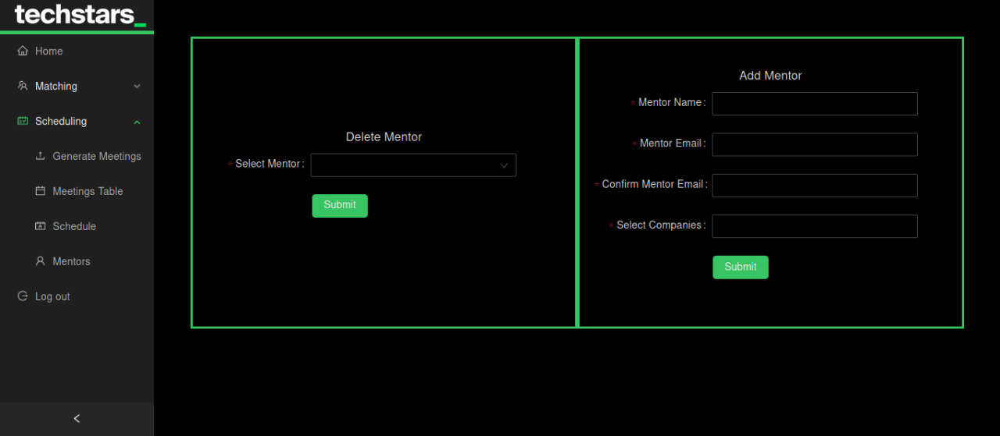
* Add & Delete Mentors, as its name implies, it will allow the staff to add new mentors or remove them from the Techstars programm.
# Survey_Filling_App
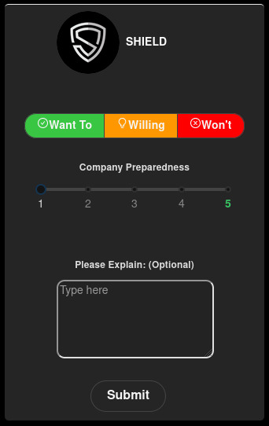
The mentors and the companies will access through an URL that was sent to their e-mail.
If it is the first time they are submitting surveys, all the submit buttons will be disabled, they have to perform a vote by pressing 1 of the 3 buttons that says: Want To, Willing To, Won't, once that is done, the submit button will be enabled.

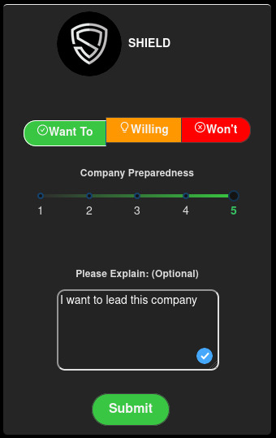
* Functional Components
 * This aplication was built as a SPA(single page application) made of functional components with useState and useEffect hooks.
 * Avatar will display a circled picture from the company or the mentor
 * This component will display the survey cards in a grid fashion using the '\<Row>\' and '\<Col>\' from the 'antd' package.
 * Will GET the number of elements to be displayed according to who the user is(company or mentor) and it will display only the meetings that already happened.
 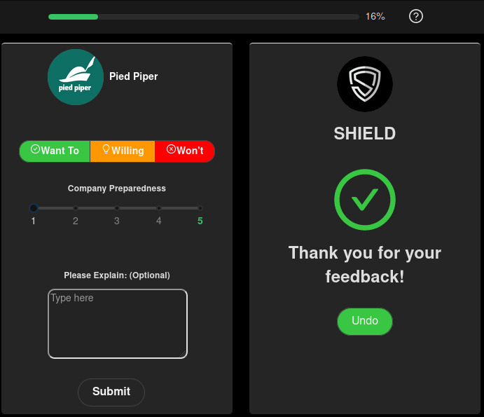
 * Has a dynamic progress bar that will be filled by submitting the survey cards, or decreased by pressing undo.
 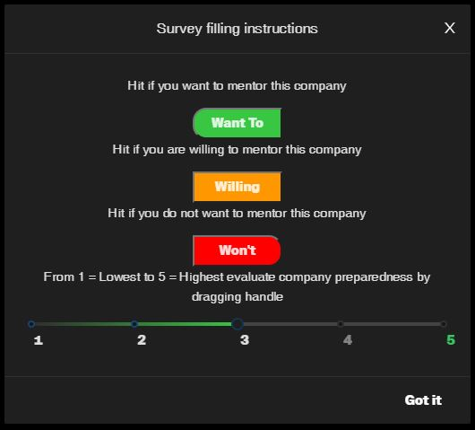
 * By pressing the "?" mark on the top bar you will display the survey filling instructions.
 * The slider ranges from 1 to 5 to evaluate by dragging Mentor Helpfullness or Company Preparedness,
 * Textarea will allow to have up to 200 characters as written feedback.
 * Submit button will POST or PUT the data that is on the card and perform a flip animation.
 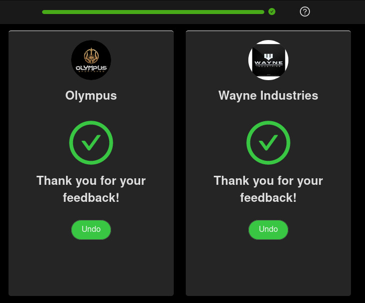
 * Undo button will flip back the card, so the user will be able to edit the answers.
# Data_Dashboard
The data dashboard will consist of 3 general views which are:
 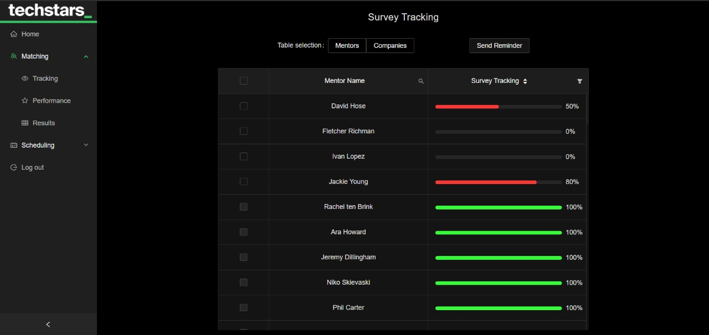 
* Tracking: Consists of tables that display the status or the the progress reagrding the survey filling by mentors and companies, this view allows to select either mentor or company that is missing to fill out a survey, so the reminder will be sent to their email, it also allows to display the missing surveys or the submitted ones.
 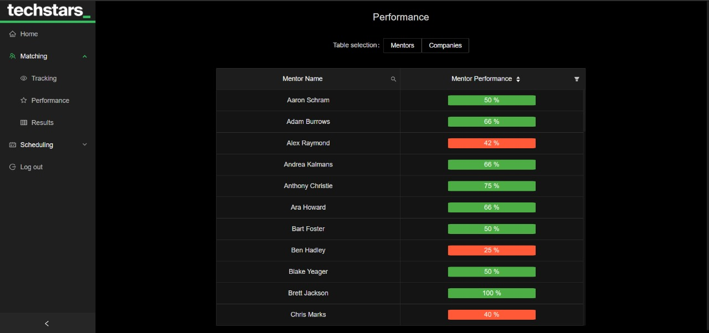 
* Performance: Consists of tables that display the performance by mentor or company, so the staff will be able to take action regarding the least wanted company or mentor, and the contrary case as well, it will display a graphic chart for every company or mentor.
 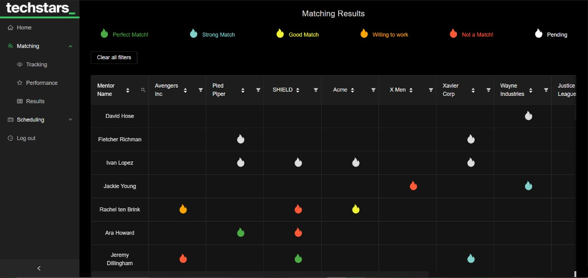 
* Results: Consists of tables that display the matching results from mentors and companies.
# Contributors

  

    <table>
      <tr>
        <td valign="top" align='center'>
          <a href="https://github.com/valen2510/" target="_blank">
            
Valentina Jaramillo

            
          </a>
           
          
          
        </td>
        <td valign="top" align='center'>
          <a href="https://github.com/oomsebas" target="_blank">
            
Sebastian Orozco

            
          </a>
           
          
          
        </td>
        <td valign="top" align='center'>
          <a href="https://github.com/MarcosPimienta" target="_blank">
            
Marcos Pimienta

            
          </a>
           
          
          
        </td>
        <td valign="top" align='center'>
          <a href="https://github.com/devarias" target="_blank">
            
David Arias Fuentes

            
          </a>
           
          
          
        </td>
      </tr>
    </table>
  

